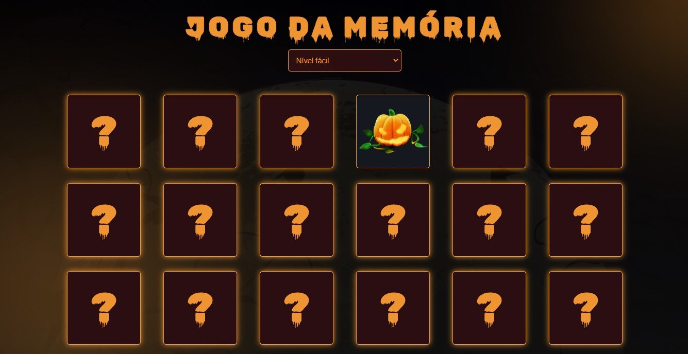
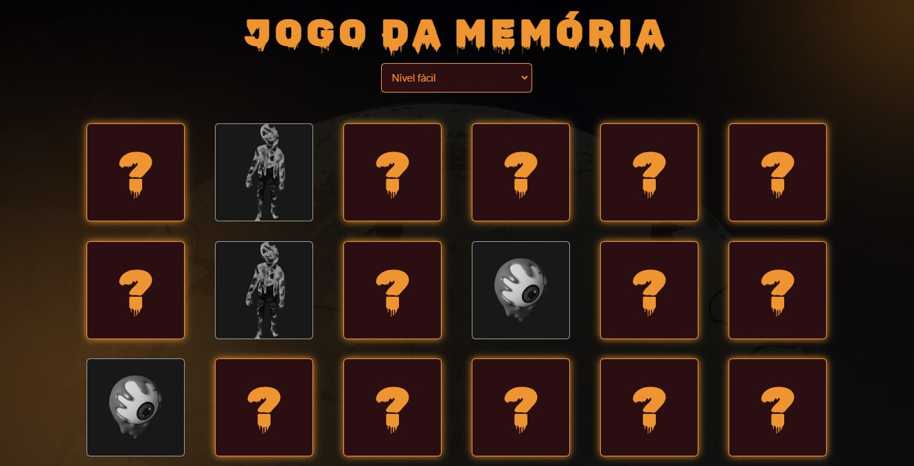
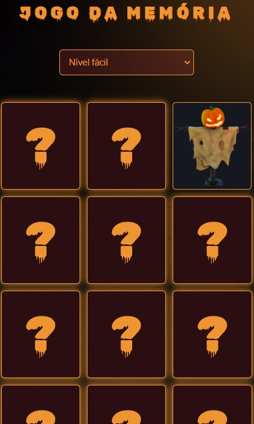
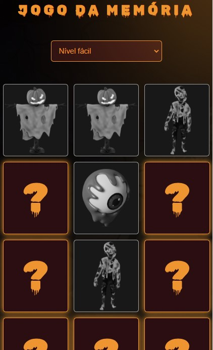

# Desafio-11 Jogo da Memória (Codelandia)

### link do projeto no Figma: https://www.figma.com/file/Yb9IBH56g7T1hdIyZ3BMNO/Desafios---Codel%C3%A2ndia?node-id=29500%3A2

## link: https://pedro-andre.github.io/Jogo-da-Memoria/

## Início do jogo

## Cartas combinadas

## Início do jogo - Mobile

## Cartas combinadas - Mobile

